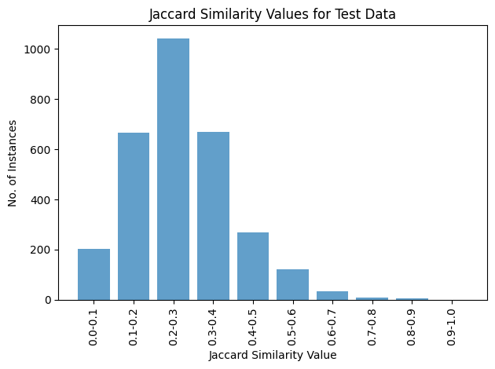
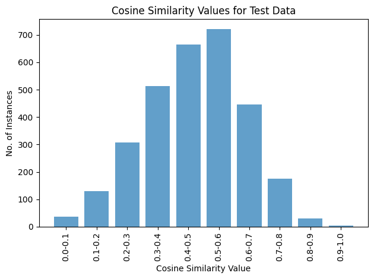

# Project Report (English-Hindi Translation)
**✨Explore our English-to-Hindi Translation Tool: [Click Here](https://huggingface.co/spaces/lostUchiha/En_Hi_Translation)!**

**Code:**<a target="_blank" href="https://colab.research.google.com/github/ravindramohith/CS337_Project/blob/main/CS337_PROJECT.ipynb">
  
</a>

**Course:** CS 337: AI ML 

**Team:**
- Pamba Ravindra Mohith, 210050112
- Ramavath Sai Srithan, 210050132
- Ramaswamy Santhosh Reddy, 210050131
- Thota Sri Lakshmi Teja, 210050158
- Karanam Lokesh, 210050081 

## Table of Contents
1. [Introduction](#1-introduction)
2. [Objectives](#2-objectives)
3. [Dataset](#3-dataset)
4. [The Model](#4-the-model)
   - 4.1 [Model Preprocessing](#41-model-preprocessing)
      - 4.1.1 [Subword Tokenization](#411-subword-tokenization)
      - 4.1.2 [Examples](#412-examples)
   - 4.2 [Helsinki-NLP Opus-MT Model](#42-helsinki-nlp-opus-mt-model)
      - 4.2.1 [Model Source](#421-model-source)
      - 4.2.2 [Encoder Layers](#422-encoder-layers)
      - 4.2.3 [Decoder Layers](#423-decoder-layers)
      - 4.2.4 [Capabilities](#424-capabilities)
      - 4.2.5 [Key Advantages](#425-key-advantages)
      - 4.2.6 [Application Areas](#426-application-areas)
   - 4.3 [Working of Helsinki-NLP Opus-MT Model](#43-working-of-helsinki-nlp-opus-mt-model)
      - 4.3.1 [Input Processing](#431-input-processing)
      - 4.3.2 [Encoding](#432-encoding)
      - 4.3.3 [Decoding](#433-decoding)
      - 4.3.4 [Output](#434-output)
5. [Hyperparameters and Fine Tuning](#5-hyperparameters-and-fine-tuning)
   - 5.1 [AdamW Optimizer Overview](#51-adamw-optimizer-overview)
6. [Data Processing Steps](#6-data-processing-steps)
7. [Evaluation Metrics](#7-evaluation-metrics)
   - 7.1 [Jaccard Similarity](#71-jaccard-similarity)
   - 7.2 [Cosine Similarity](#72-cosine-similarity)
   - 7.3 [BLEU Score](#73-bleu-score)
      - 7.3.1 [BLEU Score Range](#731-bleu-score-range)
8. [Limitations](#8-limitations)
   - 8.1 [Resource Constraints](#81-resource-constraints)
   - 8.2 [Hyperparameter Tuning](#82-hyperparameter-tuning)
   - 8.3 [Model Interpretability](#83-model-interpretability)
9. [Deployment](#9-deployment)

## Goal of the Project
This project focuses on building a robust machine translation model for English-to-Hindi using the state-of-the-art Helsinki-NLP/opus-mt-en-hi pre-trained model from Hugging Face Transformers. The primary objectives are to load and preprocess the CFILT IITB English-Hindi dataset, fine-tune the model, save it for future use, and demonstrate its translation capabilities.  


## 1 Introduction
Machine translation, the automated process of converting text from one language to another, has witnessed significant advancements owing to the development of sophisticated natural language processing (NLP) models. This project centers on the task of translating English text to Hindi, utilizing the vast potential of transformer-based architectures and leveraging the CFILT-IITB dataset, which contains parallel English-Hindi text pairs. The primary objective is to build a robust and accurate machine translation system that effectively bridges the linguistic gap between English and Hindi, relying on the Helsinki-NLP model, a cutting-edge transformer-based architecture.

This introduction sets the stage for a comprehensive exploration of the methodologies employed, challenges encountered, and the outcomes attained in the pursuit of developing an efficient machine translation system utilizing the CFILT-IITB dataset and the Helsinki-NLP model for English to Hindi translation.

## 2 Objectives
The objectives of this project are outlined as follows:
1. Implement a machine translation system capable of translating English text to Hindi.
2. Utilize the CFILT-IITB dataset for training and evaluation purposes in the development of the translation model.
3. Evaluate the performance of the translation model using various metrics, including Jaccard, Cosine Similarities, and BLEU score.
4. Deploy the Helsinki-NLP model using the Hugging Face Interface effectively to create a functional translation service for English to Hindi translation.


## 3 Dataset
The CFILT-IITB dataset, encompassing parallel English-Hindi text pairs, was acquired using the Hugging Face datasets library. The dataset arrived pre-segmented into three distinct parts:

- Train set comprising 1.66 million instances.
- Validation set containing 520 instances.
- Test set consisting of 2.51 thousand instances.

Due to resource constraints, we opted to limit the number of instances in the train, validation, and test sets. Initially, the pre-segmented data was combined into a unified dataset, followed by a random shuffling process. The objective of shuffling was to ensure that the new subset of 30,000 instances could effectively represent the entirety of the original dataset.

From the 30,000 instances, we conducted a split into train, test, and validation sets using an 80-10-10 ratio. This process allowed for a more manageable subset while maintaining a representative distribution of instances across the train, validation, and test sets, enabling a comprehensive and efficient exploration of the dataset within our resource constraints.

The dataset is structured with a single column labeled "Translations," where each row consists of a dictionary. These dictionaries include pairs of language codes and their corresponding translated text. The data is organized in a structured manner, with each dictionary serving to provide translations for different languages.

For instance, consider the following example: `{ "en" : "My name is Alex", "hi" : "" }`.


## 4 The Model
### 4.1 Model Preprocessing
The tokenizer, leveraging TFAutoModelForSeq2SeqLM from the Helsinki- NLP model, transforms raw text into a sequence of token IDs, enabling the neural network model’s processing.

#### 4.1.1 Subword Tokenization
Helsinki-NLP employs subword tokenization strategies, such as Byte Pair Encoding (BPE) or SentencePiece. These techniques break down words into smaller units (subwords), facilitating the handling of rare or unknown words and enhancing translation accuracy. For example, an unseen word during training can be decomposed into smaller known subwords, allowing the model to effectively translate it. The Helsinki-NLP tokenizer, specifically designed for the "Helsinki-NLP/opus-mt-en-hi" model, operates on the principles of neural machine translation tokenization.

#### 4.1.2 Examples
Single Sentence:
```python
tokenizer("Hello, this is a sentence!")
# Output: {'input_ids': [12110, 2, 90, 23, 19, 8800, 61, 0], 'attention_mask': [1, 1, 1, 1, 1, 1, 1, 1]}
```

### 4.2 Helsinki-NLP Opus-MT Model
#### 4.2.1 Model Source
The Helsinki-NLP Opus-MT model is available [here](model_source_link).

#### 4.2.2 Encoder Layers
The model is structured with 6 encoder layers, each employing the following mechanisms:
- Self-Attention Mechanism: Each layer in the encoder utilizes self-attention to concurrently process the entire input sequence. This mechanism empowers the model to evaluate the significance of different words in the sentence in relation to each other.
- Feed-Forward Neural Network: Following the attention layer, a feed-forward neural network processes the output sequentially. This network applies non-linear transformations to enhance the representation of the input.

#### 4.2.3 Decoder Layers
Similarly, the model features 6 decoder layers, each incorporating the following components:
- Masked Self-Attention: Similar to the encoder’s self-attention, the masked self-attention in the decoder is 'masked' to prevent the decoder from peeping into future tokens in the sequence. This ensures that predictions for a word at a position depend solely on the known words before it.
- Encoder-Decoder Attention: In this step, the decoder layers focus their attention on the encoder’s output. This process is vital for aligning the input (source language) and output (target language) sequences, playing a pivotal role in ensuring translation quality.
- Feed-Forward Neural Network: Just like in the encoder, each decoder layer is equipped with a feed-forward network that further processes the sequence, contributing to the overall complexity and expressiveness of the model.

#### 4.2.4 Capabilities
- Language Pairs: The model is specifically trained for English to Hindi translation. It is part of the larger Opus-MT project, which encompasses a wide array of language pairs.
- Architecture: The model utilizes the TFAutoModelForSeq2SeqLM architecture from the Transformers library.
- Dataset: It has been trained on diverse and extensive datasets, including the IITB English-Hindi dataset.

#### 4.2.5 Key Advantages
- Demonstrates high-quality translation capabilities.
- Leverages advanced tokenization and training techniques.

#### 4.2.6 Application Areas
The model proves effective for various natural language processing tasks, with a particular emphasis on English to Hindi translation.

### 4.3 Working of Helsinki-NLP Opus-MT Model
The Helsinki-NLP/opus-mt-en-hi model is purpose-built for translation between English and Hindi.

#### 4.3.1 Input Processing
The model initiates the process by breaking down the input sentence into tokens, which can be words or sub-words.

#### 4.3.2 Encoding
The encoder layers, consisting of 6 layers with attention mechanisms, meticulously analyze the input sentence. This analysis enables the model to comprehend the contextual intricacies and nuances of the sentence. Each layer contributes to a progressively deeper understanding.

#### 4.3.3 Decoding
Following the encoding phase, the decoder layers take charge of generating the Hindi translation token by token. Leveraging the context provided by the encoder and its own previous outputs, the decoder predicts the subsequent word. With 6 layers and attention mechanisms, the translation is ensured to be contextually appropriate and grammatically sound.

#### 4.3.4 Output
The model yields the translated Hindi sentence corresponding to the input sentence.

## 5 Hyperparameters and Fine Tuning
After utilizing grid search to tune the parameters, we transitioned to using the best parameters directly, omitting the grid search due to its time-consuming and resource-intensive nature. The hyperparameters employed are as follows:
- Batch Size: 16
- Learning Rate: 2e-5
- Weight Decay: 0.01
- Number of Epochs: 1

Additionally, we utilized the AdamWeightDecay optimizer to manage weight training efficiently.

### AdamW Optimizer Overview
The AdamW optimizer, short for "Adam Weight Decay," is a variant of the Adam optimizer that includes an additional term for weight decay regularization. It aims to address weight decay issues observed in the original Adam optimizer.

1. **Adam Optimizer Overview:**
    - Adam (Adaptive Moment Estimation): Adam is an adaptive learning rate optimization algorithm that combines ideas from RMSprop and momentum. It maintains per-parameter learning rates and exponentially moving averages of gradients’ squares and gradients, respectively.
    - Adaptive Learning Rates and Momentum: Adam adjusts learning rates for each parameter and includes momentum to accelerate gradients in the right direction.

2. **AdamW - Addressing Weight Decay Issue:**
    - Weight Decay: Weight decay prevents overfitting by penalizing large weights in the loss function (equivalent to L2 regularization).
    - Issue in Adam: The original Adam optimizer doesn’t correctly implement weight decay, leading to different training behaviors and potential performance issues.

3. **AdamW - Optimizing with Weight Decay:**
    - Additional Term for Weight Decay: AdamW explicitly adds the weight decay regularization term to address the issue, ensuring proper weight decay during optimization.
    - Improvement and Benefits: AdamW improves training stability and potentially enhances model generalization by correctly applying weight decay.

4. **Key Features and Benefits of AdamW:**
    - Improved Regularization: Ensures proper weight decay implementation, enhancing model generalization.
    - Stable Training: Helps maintain stable training dynamics by correctly applying weight decay.

5. **Usage:**
    - Parameters: Accepts parameters similar to Adam (e.g., learning rate, weight decay rate, beta parameters).
    - Implementation: Available in popular deep learning libraries like PyTorch and TensorFlow as an optimizer option.

6. **Considerations:**
    - Hyperparameter Tuning: Still requires tuning hyperparameters like learning rate, weight decay rate, etc., based on the specific problem and dataset.

*Conclusion: AdamW, an extension of the Adam optimizer, addresses weight decay issues by incorporating proper weight decay regularization during optimization. Its improvements in stabilizing training dynamics and ensuring correct weight decay implementation make it a valuable optimization technique in deep learning.*

## 6 Data Processing Steps
For the following steps, we limit the length of the sequences for both source and target to 128.

The Tokenizer used in the project is a pre-defined tokenizer that is loaded from the Helsinki NLP model. The Preprocessing function defined in the code is using the above tokenizer for both the source language instances as well as the target language instances. Finally, we use data collators with model and tokenizer from Helsinki-NLP model with return datatype as a TensorFlow tensor.

The data collator used in this project is DataCollatorForSeq2Seq, which is a utility class typically used in Hugging Face’s transformers library for sequence-to-sequence tasks. It helps in collating and formatting data for training sequences by handling padding, truncation, and preparing inputs and labels for the model.

## 7 Evaluation Metrics
The evaluation metrics used in this project are:
### 7.1 Jaccard Similarity
Jaccard similarity is a statistical measure used to compare the similarity and dissimilarity between two sets. It measures the intersection over the union of two sets and is particularly useful in cases where the presence or absence of elements matters more than their frequency or order.

The Jaccard similarity coefficient is calculated as the ratio of the size of the intersection of the sets to the size of the union of the sets:

\[ Jaccard Similarity(A,B) = \frac{|A \cap B|}{|A \cup B|} \]

For our analysis, we divided the translated dataset into 10 classes based on Jaccard similarity ranges, such that the first class elements have a Jaccard similarity between 0 and 0.1, the second class between 0.1 and 0.2, and so forth. We utilized this classification to create a bar graph for easy interpretation of the data.

However, Jaccard Similarity has certain limitations:
- Sensitive to Set Size: Jaccard similarity might not be ideal when dealing with sets of significantly different sizes.
- Disregard for Element Frequency: It does not consider the frequency or importance of elements within the sets, treating all elements equally, which may not be suitable in contexts where element importance matters.
- Limited for Text Comparison: In text comparison, Jaccard similarity does not consider the sequence or order of words, treating text as a bag of words, disregarding grammatical structure and word order.

These limitations imply that Jaccard Similarity might not serve as a fully representative metric for our project.

### 7.2 Cosine Similarity
In the context of machine translation, Cosine Similarity measures the similarity between translated sentences represented as vectors in a high-dimensional space. It allows us to assess the quality and fidelity of translations by comparing the orientation of vectors obtained from the source and translated texts.

The Cosine Similarity between the source (S) and translated (T) sentences or documents can be calculated using the formula:

\[ Cosine Similarity(S,T) = \frac{S \cdot T}{\|S\| \cdot \|T\|} \]

Here, \(S \cdot T\) represents the dot product of the source and translated sentence vectors, while \(\|S\|\) and \(\|T\|\) denote their respective Euclidean norms.

In our machine translation evaluation, we used Cosine Similarity to determine the closeness of translated sentences to their corresponding source sentences. This metric assists in gauging the level of semantic equivalence and accuracy between the original and translated texts.

To visually represent the evaluation results, we created a bar graph plotting the Cosine Similarity scores for various translated sentences against their respective source sentences. This graph aids in illustrating the degree of similarity achieved by the translation model across different sentence pairs.


### 7.3 BLEU Score
BLEU (Bilingual Evaluation Understudy) is a metric commonly used for evaluating the quality of machine-translated text. It measures the similarity between the reference (original) and candidate (translated) texts based on n-grams, which are contiguous sequences of n items, typically words. BLEU is calculated using precision, which measures the percentage of n-grams in the candidate text that are also present in the reference text.

The BLEU score is defined as follows:

\[ BLEU = \text{BP} \times \exp\left(\sum_{n=1}^{N} \frac{1}{N} \log p_n\right) \]

Here:
- \(N\) is the maximum order of the n-grams considered.
- \(p_n\) is the precision for n-grams.
- \(\text{BP}\) is the brevity penalty, which penalizes shorter translations.

In our evaluation, we computed the BLEU scores for the translated sentences using the original English sentences as references. This allowed us to quantify the quality of the translations across different sentence pairs and assess the model's overall performance.

### 7.4 Visualization of Evaluation Metrics
To provide a comprehensive overview of the model's performance, we generated visualizations for each evaluation metric. These visualizations include bar graphs for Jaccard Similarity, Cosine Similarity, and BLEU scores. The graphs are organized to facilitate a comparative analysis of the translation quality across different sentence pairs.

#### 7.4.1 Jaccard Similarity Bar Graph
The Jaccard Similarity bar graph illustrates the distribution of Jaccard Similarity scores across various classes. Each class represents a range of Jaccard Similarity values, allowing us to observe how well the translations align with the source sentences.



#### 7.4.2 Cosine Similarity Bar Graph
The Cosine Similarity bar graph provides insights into the semantic similarity between source and translated sentences. It showcases the degree of alignment between the vectors representing these sentences in a high-dimensional space.



#### 7.4.3 BLEU Score Bar Graph
The BLEU Score bar graph offers a quantitative measure of the translation quality by comparing the n-grams of the translated sentences with the reference English sentences. It helps in understanding how well the model captures the essence of the original text.


### 7.5 Model Evaluation Summary
In summary, the model's performance is assessed using multiple metrics to ensure a comprehensive understanding of its strengths and weaknesses. The Jaccard Similarity, Cosine Similarity, and BLEU scores collectively provide insights into the model's ability to produce accurate and contextually relevant translations. The visualizations aid in interpreting the results and identifying patterns or areas that may require further improvement.

## 8 Challenges Faced
### 8.1 Resource Constraints
One of the primary challenges encountered was resource constraints, particularly in terms of memory and processing power. The large size of the CFILT-IITB dataset and the complexity of the Helsinki-NLP transformer model demanded significant computational resources. To address this challenge, we implemented strategies such as data subsampling and optimizing batch sizes to fit within the available resources.

### 8.2 Hyperparameter Tuning
Fine-tuning the model involved extensive hyperparameter tuning to achieve optimal performance. The process required multiple iterations and consumed considerable time. We navigated this challenge by employing grid search initially and subsequently transitioning to the best parameters identified through the search.

### 8.3 Model Interpretability
Interpreting the inner workings of transformer-based models can be challenging due to their complex architecture and attention mechanisms. Ensuring a deep understanding of the model's behavior was crucial for effective fine-tuning and addressing translation errors.

## 9 Deployment
We deployed our app by gradio on hugging face. You can find out [here](https://huggingface.co/spaces/lostUchiha/En_Hi_Translation)

**For more information, [click here](./report.pdf) and view our detailed documentation report.**